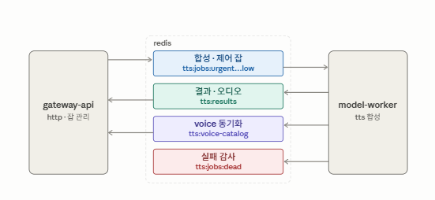

# QueueTTS — 통합 아키텍처

두 저장소가 하나의 TTS 시스템을 이룬다. 서로의 존재(URL·개수·위치)를 전혀 모른 채
**오직 Redis 로만** 통신한다.

| | **GATEWAY-API** | **MODEL-WORKER** |
|---|---|---|
| 디렉터리 | `gateway-api` | `worker-supertonic` / `worker-qwen` |
| 역할 | 프론트도어 — HTTP API, 잡 관리, 이력 영속화 | TTS 합성 엔진 — 실제 음성 생성 |
| 스택 | Kotlin · Spring Boot 3.5 · Java 21 · PostgreSQL | Python · Supertonic · ONNX(CPU/GPU) |
| HTTP 서버 | 있음 (클라이언트 대면) | **없음** (Redis 만 소비) |
| Redis 관점 | 잡 producer + 결과 consumer(`gateway` 그룹) | 잡 consumer(`tts-workers` 그룹) + 결과 producer |
| 상태 저장 | 진행중=in-memory, 완료=PostgreSQL 이력 | stateless — 진행/결과 이벤트만 스트림에 기록 |
| Voice 소스 | Redis catalog 를 읽기만 | Supertonic 기본 `F1~F5`/`M1~M5` + 로컬 `custom_styles/*.json` |
| 확장 | 단일 인스턴스(결과 consumer) | 수평 확장 (worker N대) |

## 통신 흐름

```
클라이언트 ─HTTP─▶ GATEWAY-API ──XADD──▶ tts:jobs:{priority} ──XREADGROUP──▶ MODEL-WORKER
                                                                              │ (TTS 합성)
클라이언트 ◀─HTTP─ GATEWAY-API ◀─XREADGROUP── tts:results ◀──XADD─────────────┘
```

- Gateway 는 접수한 작업을 **우선순위별 스트림**(`tts:jobs:urgent|high|normal|low`)에 XADD 만 한다.
- Worker 는 `tts-workers` consumer group 에서 **높은 우선순위부터** non-blocking 으로 가져가
  `running` 이벤트를 XADD 한 뒤 처리하고, terminal 결과를 `tts:results` 에 XADD 하고 원본 job 을 XACK 한다.
- Gateway 는 `gateway` consumer group 으로 진행/결과 이벤트를 소비해 `wait → running → terminal` 상태를 반영한다.

상세 메시지 규약: [redis-queue-contract.md](redis-queue-contract.md).

## 용어

| 용어 | 뜻 |
|---|---|
| **Job** | 하나의 합성/제어 단위. `jobId`(예: `job_ab12cd34`)로 식별. |
| **Priority** | `urgent` > `high` > `normal` > `low`. 스트림이 우선순위별로 분리됨. 등록 후 변경 불가, 동일 우선순위는 FIFO. |
| **Control request** | 잡이 아닌 일회성 요청/응답. `jobId` 가 `req_` 접두사. `styles`(보이스 목록 조회). 짧은 timeout(기본 30초). |
| **Artifact** | 완성된 오디오 바이트. base64 로 result 스트림에 실려 전달(별도 파일 공유 없음). 최대 크기 `queuetts.job.artifact-max-bytes`(기본 100MB). |
| **Consumer group** | worker=`tts-workers`(잡 스트림), gateway=`gateway`(결과 스트림). |
| **Lease / pending** | worker 가 XREADGROUP 으로 가져갔지만 아직 XACK 안 한 상태. 처리 중엔 XCLAIM 으로 idle 을 리셋(lease 갱신). |
| **Dead** | 죽은 worker 가 남긴 pending 은 **재처리하지 않고** 실패 처리하며, 원본을 `tts:jobs:dead` 에 감사용으로 남김(중복 합성·긴 대기 방지). |
| **Voice catalog** | 사용자에게 노출하는 검증된 voice 목록. worker 가 Redis 에 직접 기록, Gateway 는 읽기만. |

## 파이프라인별 기능

Redis 를 사이에 두고 흐르는 독립적인 파이프라인들이다. 각 파이프라인은 방향·Redis 경로·기능이 다르다.



| 파이프라인 | 방향 | Redis 경로 | 기능 |
|---|---|---|---|
| ① 합성 잡 | Gateway → Worker | `tts:jobs:{priority}` (XADD → XREADGROUP) | 텍스트→음성 합성. 우선순위·FIFO·batch 처리 |
| ② 제어 요청 | Gateway → Worker | `tts:jobs:{priority}` (`req_` + type=styles) | 보이스 목록 조회. 짧은 timeout 의 request/reply |
| ③ 상태/결과 회수 | Worker → Gateway | `tts:results` (XADD → XREADGROUP → XACK+XDEL) | running 전이, 오디오 artifact(base64)·제어 응답 전달, 잡 종료 |
| ④ 실패 감사 | Worker → (자체) | `tts:jobs:dead` (XADD) | 죽은 worker 의 pending 을 재처리 없이 실패 처리하고 원본 보존 |
| ⑤ voice 동기화 | Worker ↔ Worker | `tts:voice-catalog`(+`:state`) | worker 간 voice 목록 일관성 검증(불일치 시 자가 종료). Gateway 는 읽지 않음 (아래 별도 절) |
| ⑥ worker 상태 | Worker → Gateway | 잡 스트림의 `XINFO CONSUMERS`/`GROUPS` | active worker 집계, pending/idle, 유령 consumer 정리 |

⑤와 ⑥은 **같은 liveness 신호**(잡 group 의 `XINFO CONSUMERS`)를 공유한다. worker 존재 판정은 한 곳뿐이다.

### ① 합성 잡
- 입력 API: `POST /api/jobs`. 호출자 구분은 요청 본문의 `source` 필드로 전달한다(예: `user`·`counselor` → 기본 우선순위 결정). 클라이언트도 `POST /api/jobs` 에 TTS payload 를 제출한 뒤 `GET /api/jobs/{jobId}` 로 완료를 폴링한다. Redis 발행 시 Gateway 가 메시지 `type=tts` 를 지정한다.
- 발행 주체: `RedisStreamQueueClient.publishJob()` — 우선순위 스트림에 XADD, `XTRIM MAXLEN` 로 스트림 길이 제한.
- 소비 주체: worker `read_new_jobs()` — `urgent→high→normal→low` 순 non-blocking 폴링, `QUEUETTS_BATCH_SIZE` 만큼 묶어 처리.
- 진행/완료 이벤트는 결과 스트림을 통해 `wait → running → terminal` 상태로 반영되며, 클라이언트는 `GET /api/jobs/{jobId}` 폴링 또는 `/api/jobs/{jobId}/events`(SSE)로 확인한다. 오래 완료되지 않은 job 은 `JobTimeoutSweeper` 가 `failed` 로 닫는다(`queuetts.worker-timeout-seconds`, 기본 60초).

### ② 제어 요청 (styles)
- 입력 API: `GET /api/styles[?model=]` (내부적으로 제어 요청 type=`styles` 를 발행). 사용 가능한 보이스 목록(빌트인 보이스 + 커스텀 voice 이름)을 반환한다. `model` 을 생략하면 살아있는 워커가 있는 모든 엔진 풀을 병렬 조회해 합치고, 각 style 에 `model` 을 붙인다.
- ①과 같은 잡 스트림을 쓰되 `jobId` 가 `req_` 접두사라 Gateway job 으로 영속화되지 않는다(`RedisQueueClient.requestStyles`).
- consumer group 특성상 worker 한 대만 수신한다. worker 들이 custom style 저장소를 공유하지 않으면 목록이 다를 수 있다(voice-catalog 로 일관성만 검증).

### ③ 결과 회수
- worker `flush_batch_results()` 가 batch 처리 후 `tts:results` 에 XADD → `XACK`.
- Gateway `JobResultListener` 가 `gateway` consumer group 으로 소비 → 잡 종료 → `XACK`+`XDEL`(결과 스트림이 쌓이지 않음).
- 완료 잡은 PostgreSQL `tts_job_generation_history` 에 영속화하며, 진행 중·완료 job 모두 `/api/jobs`·`/api/jobs/{jobId}` 에서 조회한다.
- **영속화한 job 은 즉시 in-memory working set 에서 비운다.** 그래서 메모리에 남는 것은 진행 중(wait/running) job 뿐이고, 끝난 job 은 조회할 때마다 DB 에서 읽는다 — DB 행을 지우면 그 즉시 API 에서도 사라지고, 프로세스가 오래 떠 있어도 job 이 쌓이지 않는다. 예외는 이력 기록에 실패한 job 으로, 사라지지 않도록 메모리에 남기고 응답의 `historyError` 에 사유를 싣는다.
- 결과 유실 시 `POST /api/jobs/{jobId}/requeue` 로 재발행. timeout 은 `JobTimeoutSweeper` 가 정리.

### ④ 실패 감사 (dead-letter)
- worker `reclaim_pending()` 가 다른/죽은 worker 의 오래된 pending 을 `XAUTOCLAIM` 으로 회수하되, **재합성하지 않고 실패로 떨군다**(중복 합성·긴 대기 방지). 원본 필드는 `tts:jobs:dead` 에 `reason=worker-crashed` 로 남긴다.

### ⑥ worker 상태
- Gateway `RedisStreamQueueClient.workerResponses()` 가 우선순위별 스트림의 `XINFO CONSUMERS` 를 합산.
- `idle ≤ workerActiveIdleMs`(기본 30초) 인 consumer 만 active 로 집계, `pending=0` 이며 `idle > workerEvictIdleMs`(기본 5분) 인 consumer 는 그룹에서 삭제.
- ⑤ voice 동기화도 이 신호를 그대로 쓴다. worker 존재 판정은 이 한 곳뿐이다.

## Voice 목록 동기화 (순수 Redis, worker 간)

worker 들이 서로의 voice 목록 일관성을 맞추기 위한 장치다. 각 worker 가 시작 시
자기 voice 목록을 Redis catalog 에 기록·비교한다. Gateway 는 catalog 를 읽지 않으며,
사용 가능한 보이스 목록은 `GET /api/styles` 의 스타일 이름으로 노출한다.

- 살아있는 다른 worker 가 없으면 → 자기 목록을 catalog 로 기록(기준이 됨).
- 살아있는 다른 worker 가 있으면 → 자기 목록을 catalog 와 비교. **일치하면 기동, 다르면 스스로 종료.**
- active worker 가 0 이 되어도 catalog 는 남고, 다음에 기동하는 worker(active peer 0)가 새 기준으로 덮어쓴다.

상세: [voice-sync-design.md](voice-sync-design.md).

> **worker 수는 하나의 신호로 센다**
> 잡/워커 상태(`/api/health`, admin overview)와 voice 동기화 모두 잡 스트림 consumer group 의
> `XINFO CONSUMERS`(active = idle ≤ `worker-active-idle-ms`) 하나만 본다. 별도의 heartbeat key 는 없다.

## Redis key 맵

| Key | 용도 | 기록 주체 |
|---|---|---|
| `tts:jobs:{urgent\|high\|normal\|low}` | 우선순위별 잡 스트림 | Gateway |
| `tts:jobs:dead` | 실패로 떨군 원본(감사용) | Worker |
| `tts:results` | 결과 스트림 | Worker |
| `tts:voice-catalog` / `:state` | 검증된 voice 목록·준비 상태 | Worker |
| `tts:voice-catalog:lock` | 동시 기동 직렬화 단기 락 | Worker |

worker 존재 여부는 별도 key 없이 잡 스트림 consumer group 으로 판정한다.

## 설정 대응 (양쪽이 일치해야 하는 값)

합성 엔진(모델)마다 워커 풀이 다르므로, 스트림·그룹·voice catalog 는 **모델별로** 맞춘다.
결과 스트림만 모든 풀이 공유한다.

| 개념 | GATEWAY-API (`queuetts.*`) | MODEL-WORKER (`QUEUETTS_*` env) | supertonic | qwen |
|---|---|---|---|---|
| 잡 스트림 prefix | `queue.models.<model>.job-stream` | `QUEUETTS_JOB_STREAM` | `tts:jobs` | `qwen:jobs` |
| 잡 consumer group | `queue.models.<model>.job-group` | `QUEUETTS_JOB_GROUP` | `tts-workers` | `qwen-workers` |
| voice catalog prefix | (Gateway 는 읽지 않음) | `QUEUETTS_VOICE_KEY_PREFIX` | `tts` | `qwen` |
| 결과 스트림 | `queue.result-stream` | `QUEUETTS_RESULT_STREAM` | `tts:results` (공유) | ← 동일 |
| active worker idle 상한 | `queue.worker-active-idle-ms` | `QUEUETTS_WORKER_ACTIVE_IDLE_MS` | 30000ms | 30000ms |
| 기본 모델 | `queue.default-model` | — | `supertonic` | — |

`queuetts.queue.models` 를 비워 두면 레거시 `queue.job-stream`/`queue.job-group` 이
`default-model` 항목 하나로 승격돼 기존 설정이 그대로 동작한다.

## 관련 문서

- [redis-queue-contract.md](redis-queue-contract.md) — Gateway ↔ Worker 큐 메시지 규약
- [voice-sync-design.md](voice-sync-design.md) — voice 목록 동기화 규칙
- GATEWAY-API `README.md`, MODEL-WORKER `README.md`

